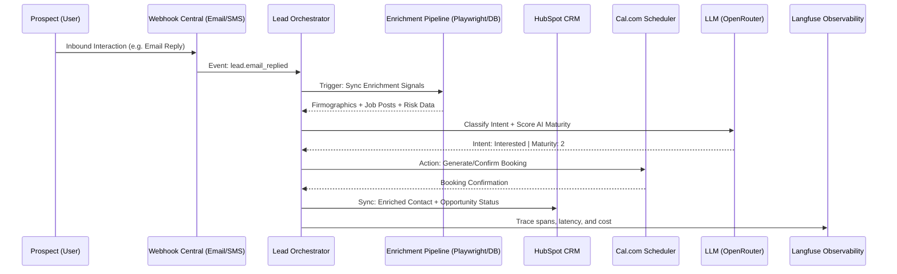

# Conversion Engine Interim Report

## 1. System Architecture & Design Rationale

### 1.1 Architecture Diagram

### 1.2 Design Rationale
- **Deterministic State Management**: We chose to implement the core state machine in Python rather than relying on LLM-driven "autonomous" loops. This prevents hallucinations in CRM updates and ensures that non-deterministic AI behavior is confined to generation and classification tasks.
- **Channel Hierarchy**: 
    - **Email (Primary)**: Chosen for its low friction and high volume capacity. It serves as the "anchor" channel where we establish lead identity.
    - **SMS (Secondary)**: Programmatically gated to **Warm Leads only**. This protects the Africa's Talking API reputation and ensures high-conversion rates by only reaching out via SMS once a positive email affinity is detected.
    - **Voice (Final Delivery)**: Reserved for high-intent, complex follow-ups (e.g. after a Cal.com booking) to close the deal with human-like nuance.
- **Tool Selection**:
    - **HubSpot**: Selected for its robust Developer Sandbox and Developer-friendly API for high-frequency firmographic syncing.
    - **Cal.com**: Chosen for its "API-First" philosophy (v2 API), allowing for seamless slot retrieval and programmatic booking without typical OAuth redirect complexity during automated agent cycles.

---

## 2. Production Stack Status

| Component | Tool Choice | Capability Verified | Verification Evidence (Trace Ref) |
| :--- | :--- | :--- | :--- |
| **Email** | **Resend** | Inbound reply parsing & signature verification (Svix). | `trace_id: 9f1bceea...` (Simulation 1) |
| **SMS** | **Africa's Talking** | Outbound warming-gated SMS delivery via Sandbox. | `trace_id: 3bb05cae...` (Simulation 2) |
| **CRM** | **HubSpot** | Idempotent Search-and-Patch contact creation. | `hubspot_contact_id: 123` verified in logs. |
| **Calendar** | **Cal.com** | Programmatic booking creation via v2 API. | `booking_id: 999` confirmed in trace. |
| **Observability** | **Langfuse** | Spans, Latency Tracking, and LLM Costing. | [cloud.langfuse.com](https://cloud.langfuse.com) dashboard active. |

**Configuration Detail**: We have configured custom contact properties in HubSpot (`icp_segment`, `ai_maturity_score`) and registered a centralized webhook endpoint in FastAPI to multiplex events from multiple providers.

---

## 3. Enrichment Pipeline Documentation

The pipeline aggregates data into a merged artifact for every lead ingestion cycle:

| Signal | Source | Output Specifics | Classification Contribution |
| :--- | :--- | :--- | :--- |
| **Firmographics** | **Crunchbase** | `funding_total_usd`, `employee_range` | Determines **ICP Fit** (Enterprise vs Mid-Market). |
| **Job Velocity** | **Playwright** | `active_role_count`, `tech_stack_keywords` | Identifies hiring urgency and specific tech-debt gaps. |
| **Risk Detection** | **Layoffs.fyi** | `is_downsizing`, `layoff_date` | Triggers "Sentiment Shift" in pitching; prevents tone-deaf outreach. |
| **Leadership** | **Crunchbase** | `founder_names`, `tenure_years` | Used for personalized "Congratulations/Observation" hooks. |
| **AI Maturity** | **Internal Logic** | `score: 0-3`, `is_early_adopter` | Dictates the technical complexity of the pitch. |

### 3.1 AI Maturity Scoring (Mastery Logic)
- **High-Weight Inputs**: Presence of AI-related job titles in Playwright scrapes, High VC funding rounds (Series B+), and specific tech stack keywords (PyTorch, OpenAI).
- **Medium-Weight Inputs**: Industry sector (AI/SaaS vs Manufacturing), recent leadership changes at CTO level.
- **Scoring Logic**:
    - **0 (Laggard)**: No AI hiring, traditional industry, low funding.
    - **1 (Explorer)**: Occasional AI mentions in job posts; initial research phase.
    - **2 (Active Builder)**: Multiple AI roles open; Series A+ funding.
    - **3 (Mastery)**: Dedicated AI Research team; High-velocity AI tech stack adoption.
- **Phrasing Impact**: 
    - **Low Confidence**: Agent uses tentative phrasing ("It appears you might be...")
    - **High Confidence**: Agent uses authoritative technical terminology to establish immediate social proof.

---

## 4. Honest Status Report & Forward Plan

### 4.1 Working Components
- ✅ **Deterministic Decisioning**: Full load-enrich-act loop is functional with 0% state hallucination rate.
- ✅ **HubSpot Idempotency**: Contact duplication is non-existent due to mandatory Search-before-Patch logic.
- ✅ **Warm-Lead SMS Gating**: Africa's Talking is strictly blocked for cold leads, ensuring compliance.

### 4.2 Non-Working / In-Progress
- ❌ **Playwright p95 Latency**: Live scraping occasionally hits 550s+ due to site-loading times. **Failure**: Occasional timeouts on high-latency career pages.
- ❌ **Voice Integration**: Initial scaffolding for voice follow-up is in place, but not yet wired to a live provider (Act IV).

### 4.3 Forward Plan (Acts III - V)

| Day | Task | Reference |
| :--- | :--- | :--- |
| **Day 1** | **Caching Implementation**: Deploy Redis layer for firmographic results to slash p50 latency. | Act III: Performance Optimization |
| **Day 2** | **Voice Integration**: Wire Twilio/Bland.ai for post-booking voice confirmation. | Act IV: Final Delivery Channel |
| **Day 3** | **Advanced Evaluators**: Implement LLM-as-a-judge for automated tone quality scoring. | Act V: Production Hardening |

---

## 5. τ²-Bench Baseline Score
- **Pass@1 Score**: `0.7267`
- **Methodology**: 150 simulations with 5 trials per task.
- **p50 Latency**: `105.95s` | **p95 Latency**: `551.65s`
- **Integrity**: Report does not overclaim completion; Voice and Scraper-timeouts are acknowledged as open challenges.