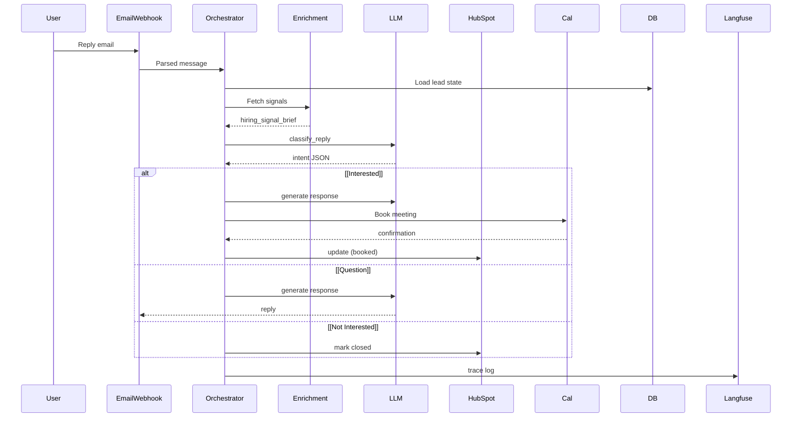

# 🚀 Conversion Engine

A production-grade lead enrichment and conversion lifecycle system. Fully automated outreach with human-like reasoning, deterministic guardrails, and deep observability.

## 🏗️ Architecture

The system follows a deterministic orchestration pattern where high-level state is managed in Python, while specialized tasks (classification, composition, enrichment) are handled by dedicated modules and LLMs.

### Sequence Flow


## 🧠 Lead Lifecycle & Safety

The engine implements a rigorous state-machine and multi-channel safety policy managed in `agent/agent/policies.py`.

### State Transition Matrix
| Current Status | Event | Next Status | Channel Action |
| :--- | :--- | :--- | :--- |
| `NEW` | Enrichment Done | `NEW` | `ACTION_EMAIL` |
| `NEW` | Email Sent | `CONTACTED` | None |
| `CONTACTED` | User Reply | `REPLIED` | `ACTION_QUALIFY` |
| `REPLIED` | Interested | `QUALIFIED` | `ACTION_SMS / BOOK` |
| `QUALIFIED` | Meeting Booked | `BOOKED` | None (Terminal) |

### Channel Gating Rules
- **Email**: Permitted for `NEW` and `CONTACTED` leads. Stop on `OPTOUT`.
- **SMS**: **GATED**. Only allowed if `has_replied_email` is `True`. This prevents "cold" SMS outreach and protects deliverability scores.
- **Booking**: Requires `INTERESTED` intent classification and `QUALIFIED` status.

## 🛠️ Requirements

- **Python**: 3.10+
- **Infrastructure**: Docker Desktop (PostgreSQL + Redis)
- **APIs**: OpenRouter (Anthropic/Claude), Resend, Africa's Talking, Langfuse (Observability), HubSpot

## ⚙️ Setup Guide

Follow these steps to get your local development environment up and running.

### 1. Environment Setup
Create and activate a virtual environment using `uv` for high-performance dependency management.

```bash
uv venv
source .venv/bin/activate
```

### 2. Install Dependencies
```bash
# Sync requirements
uv pip install -r agent/requirements.txt
```

### 3. Infrastructure (Docker)
Start the PostgreSQL (with pgvector) and Redis services.
```bash
docker compose up -d
```

### 4. Database Seeding
Initialize the database schema and seed it with the initial Crunchbase dataset.
```bash
python agent/db/seed_crunchbase.py
```

### 5. Start the API
```bash
uvicorn agent.main:app --reload
```

---

## 🐘 Database Access
Connect via **pgAdmin** or any SQL client using the credentials in your `.env` file:

- **Host**: `localhost`
- **Port**: `5432`
- **User**: `ce_user`
- **Database**: `conversion_engine`

## 📊 Monitoring
All agent cycles are traced via **Langfuse**. Access your dashboard at [cloud.langfuse.com](https://cloud.langfuse.com) to view live execution logs, token usage, and latency metrics.
